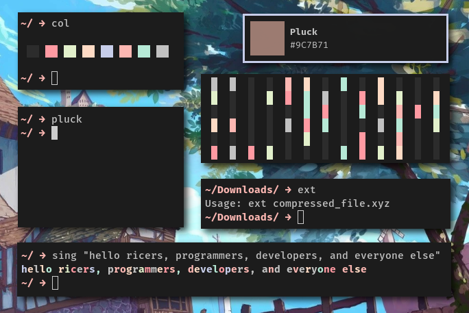

# sh
Collection Of My Sh Scripts.

# Preview
Not A Complete Preview
<p>
  
</p>


# Programs Included
```
  au              audio.
  bl              backlight.
  block           print colored blocks.
  bt              battery.
  ci              color image.
  cl              show color scheme.
  ext             extract file.
  ht              hex tool.
  nt              network.
  rain            colorful rain of text.
  random          generate random value or in a range.
  scr             screen shot/record.
  sing            print colored text.
```

# Install
```
  git clone https://github.com/manas140/sh.git && cd sh
  sudo ./install.sh i
```

# Update
This is suggested as there might be cases where some scripts are deleted

```
  sudo ./install.sh up
```

# Uninstall
```
  sudo ./install.sh u
```
