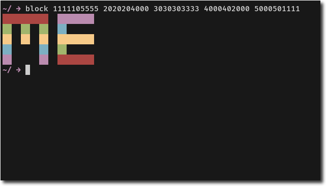
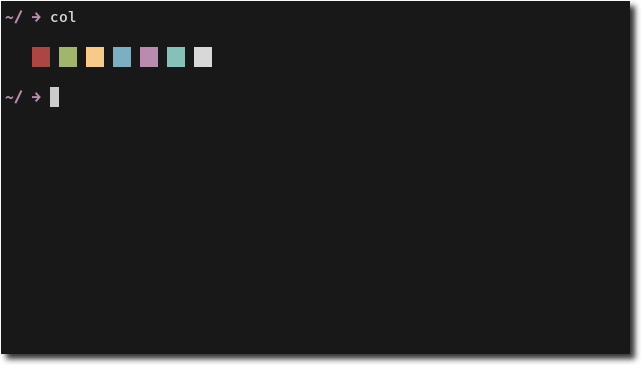
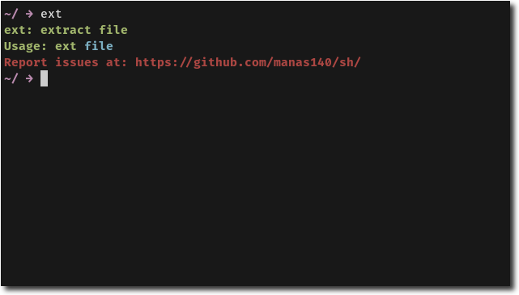
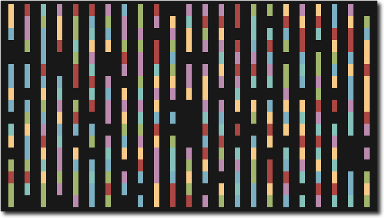
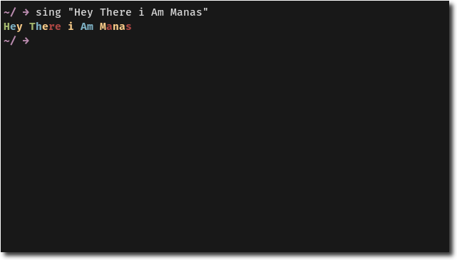
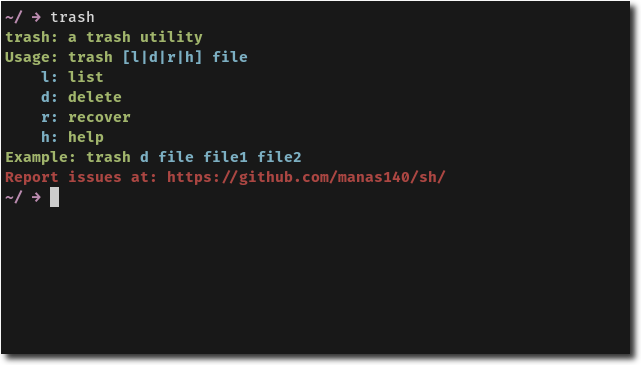

# sh
Collection Of Sh Scripts I Made 

**Preview**

<p>
  
  
   
  
    
  
</p>


**Programs Included**

```
  block           print colored blocks.
  col             show color scheme.
  ext             extract file.
  rain            colorful rain of text.
  sing            print colored text.
  trash           print colored text.
```

**Install**
```
  git clone https://github.com/manas140/sh.git && cd sh
  sudo ./install i
```
