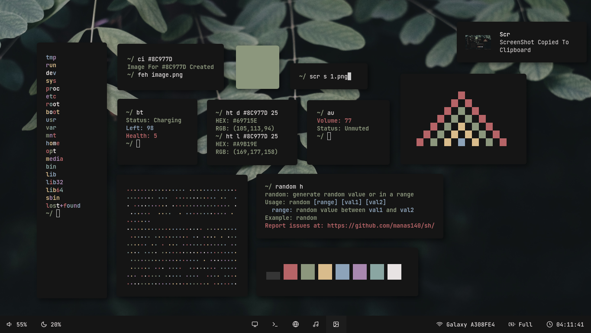

# sh
Collection Of Sh Scripts I Made 

**Preview**

<p>
  
</p>


**Programs Included**

```
  bat             battery info.
  bl              backlight.
  block           print colored blocks.
  col             show color scheme.
  cw              create wall.
  ext             extract file.
  rain            colorful rain of text.
  sing            print colored text.
  trash           print colored text.
```

**Install**
```
  #first install
  git clone https://github.com/manas140/sh.git && cd sh
  sudo ./install.sh i
  
  #update: not first install
  sudo ./install.sh up #this is prefered as there might be cases where some scripts are deleted

  #uninstall
  sudo ./install.sh u
```
